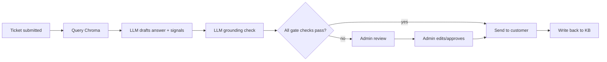

# AI Ticket Resolution System

A prototype that reads an incoming support ticket, pulls similar past tickets from a knowledge base, drafts an answer with an LLM, and either sends that answer automatically or hands it to an admin for review — depending on how confident the system is.

## 1. Overview

Support teams spend a lot of time on repetitive work: reading a ticket, searching old tickets or docs for the answer, writing a reply, and sending it. This project automates that loop end to end — retrieve relevant history, generate a proposed answer, and route it either straight to the customer or to an admin for review — as a self-contained prototype, not a finished product.

It would suit a small support team or a solo developer who wants to experiment with automating first-pass ticket responses while keeping a human able to step in.

**Important:** the system does not resolve every ticket without oversight. It only auto-sends when several independent checks agree the answer is safe (see §6); everything else goes to an admin queue for approval, editing, or rejection before it reaches the customer.

## 2. The business problem

The manual workflow being shortcut:

1. Customer submits a request.
2. Agent reads and categorizes it.
3. Agent searches docs/past tickets for relevant info.
4. Agent decides on a response.
5. Agent writes and sends it.
6. It gets filed away for next time.

Steps 2–4 are where most repeated effort lives, especially for tickets already answered many times before. The goal is to cut that repetitive work, save time searching for existing answers, give agents a consistent starting draft, and let genuinely routine tickets get answered without waiting on a person — while keeping a human in the loop for anything uncertain.

## 3. Solution

```
Ticket in → Retrieve similar past tickets → LLM drafts an answer
          → Decision gate (multiple signals) → auto-send OR admin review
```

- **Retrieve** — the ticket is embedded and used to query a Chroma vector store of past tickets.
- **Draft** — an LLM sees the new ticket plus retrieved matches and returns a proposed answer plus self-reported signals (confidence, risk flags, whether it needs human review, whether it has enough information).
- **Grounding check** — a second, independent LLM call scores how well the drafted answer is actually backed by the retrieved context.
- **Decision gate** — retrieval strength, the drafting signals, and the grounding score all have to agree before anything auto-sends.
- **Route** — pass: sent to the customer and folded back into the knowledge base. Fail: queued for admin review; once approved (possibly edited), it's sent and written back the same way.



## 4. System architecture

| Component | Role |
|---|---|
| **FastAPI** (`api/main.py`) | HTTP API; also serves the frontend as static files from the same process/port. |
| **RAG pipeline** (`src/rag_pipeline.py`) | Orchestrates retrieval, drafting, grounding check, routing decision. |
| **ChromaDB** | Persistent vector store, queried by cosine similarity. |
| **Embedding model** | `BAAI/bge-large-en-v1.5`, run locally via `sentence-transformers`. |
| **LLM client** (`src/llm_client.py`) | Calls an OpenAI-compatible chat completions endpoint for drafting and grounding checks. |
| **SQLite** (`data/ticket_knowledge_base.db`) | Ticket knowledge base plus a `pending_review` queue. |
| **SMTP notifier** | Emails the admin when review is needed, and attempts to email the customer once an answer is ready. |
| **Static frontend** (`web/`) | Plain HTML/CSS/JS — ticket form and admin dashboard, no build step. |
| **Docker** | Single-container packaging. |

It's one process, one port — FastAPI calls the pipeline directly as a Python object, and the pipeline calls the DB, Chroma, and LLM client modules directly. No message queue or service boundary between them.

The LLM client is written to work with any local, OpenAI-compatible server (Ollama, vLLM, LM Studio, etc.). As currently configured, though, `llm.base_url` points at Groq's hosted OpenAI-compatible endpoint running `openai/gpt-oss-20b` — so it's calling a hosted model, not one running on the same machine. Swapping that is a one-line config change.

## 5. Data and the knowledge base

`data/ticket_knowledge_base.db` is a SQLite database shipped in the repo with 28,262 historical tickets (subject, body, answer, type, queue, priority, plus a couple of lookup tables). It's a pre-built project knowledge base, not something the system trains on — there's no ingestion script in this repo that builds it from raw source data.

- **Loading**: `scripts/build_chroma_index.py` reads every row from SQLite.
- **Chunking**: minimal — each ticket's subject+body is embedded as one document; a `max_snippet_chars` cap (800) truncates text going into the LLM prompt, not at embedding time.
- **Embedding**: BGE-large, run locally.
- **Storage**: a Chroma collection (`data/chroma_db/`, gitignored — built locally) using cosine similarity.
- **Retrieval**: the incoming ticket is embedded (with a BGE query-side prefix) and Chroma returns the top-k nearest tickets.
- **Context passed to the LLM**: the top matches' subject, body, and prior answer, with similarity scores, formatted into the drafting prompt.

Resolved tickets (auto or admin-approved) get written back into the same SQLite table and Chroma collection, so the knowledge base grows — but no model here is trained or fine-tuned on this data.

## 6. Models and confidence/routing logic

**Model inference** (the LLM/embedding calls) and **application logic** (scoring, thresholds, routing) are separate things — the system as a whole isn't a trained model, it's a pipeline around pre-trained models plus a rule-based decision.

**Two LLM calls per ticket** (`src/llm_client.py`):

1. **Drafting** — returns the answer plus confidence, `needs_human_review`, `risk_flags` (security, legal, refund, health/safety, self-harm, angry escalation, policy exception, insufficient context), an optional `clarifying_question`, and a suggested type/queue/priority.
2. **Grounding verifier** — a fresh call that only sees the draft and the source context, scoring how well the answer is actually supported by it. A model grading its own just-written answer in the same call is a weaker check than an independent pass.

**Routing decision** (`rag_pipeline.py::_decide()`) — all of these must hold to auto-send:

- A composite retrieval score (blend of top-match similarity and the mean of all matches clearing a relevance bar) meets its threshold.
- At least a minimum number of matches individually clear that relevance bar.
- A composite confidence (blend of drafting confidence and grounding score) meets its threshold.
- No `needs_human_review`, no `risk_flags`, no `clarifying_question`.

Any failure sends the ticket to admin review instead, with the specific reason(s) stored (`gate_failures`) so an admin can see exactly why.

**Mock mode**: `USE_MOCK_LLM=true` swaps in deterministic, network-free stand-ins (`MockLLMClient`, `MockEmbeddingFunction`) for offline development and testing.

**JSON reliability**: local/smaller models aren't always consistent about valid JSON. `_parse_json()` tries several recovery strategies (stripping code fences, extracting the JSON block, fixing trailing commas) before falling back to a safe "insufficient context" escalation rather than crashing.

## 7. API

Defined in `api/main.py`:

| Method | Route | Purpose | Auth |
|---|---|---|---|
| POST | `/tickets` | Submit a ticket | none |
| GET | `/tickets/{id}` | Look up a resolved ticket | none |
| POST | `/admin/login` | Get an admin token | none |
| GET | `/admin/tickets` | Browse resolved tickets, filter by `source` | admin |
| GET/DELETE | `/admin/tickets/{id}` | Detail / delete a resolved ticket | admin |
| GET | `/admin/pending`, `/admin/pending/count`, `/admin/pending/{id}` | Review queue | admin |
| POST | `/admin/pending/{id}/approve` \| `/reject` | Act on a draft | admin |
| GET | `/health` | Liveness check | none |

**Example:**

```
POST /tickets
{ "subject": "Can't reset my password",
  "body": "The reset link never arrives.",
  "user_email": "[email protected]" }
```
```
200 OK
{ "decision": "pending_admin", "ticket_reference": 17,
  "message": "Your ticket has been received and is being reviewed...",
  "answer": null }
```

`decision` is `"auto_sent"` (with `answer` filled in) or `"pending_admin"` (with `ticket_reference` pointing at the pending-review row).

## 8. Email, configuration, and secrets

Notifications go through plain SMTP (`smtplib` + STARTTLS) — no Gmail/Outlook API. `notify_admin()` can log to console or send email; `send_to_customer()` logs to console and, if given an address, attempts an SMTP send too.

Secrets come from environment variables, never from `config/config.yaml`. The repo doesn't ship a `.env.example`; here's what `src/config_loader.py` actually reads:

| Variable | Used for | Required? |
|---|---|---|
| `GROQ_API_KEY` | LLM API auth | For real (non-mock) LLM calls |
| `HF_API_TOKEN` | Read for a Hugging Face embedding backend | Read but currently unused — embeddings run locally |
| `SMTP_PASSWORD` | Admin/customer email | If `notify_method: "email"` |
| `ADMIN_PASSWORD` | Admin login | Falls back to a dev default (`admin123`) if unset |
| `AUTH_TOKEN_SECRET` | Admin token HMAC secret | Falls back to an insecure dev default if unset |
| `USE_MOCK_LLM` | Force mock mode | Optional |

Everything else (thresholds, model names, paths, SMTP host, CORS) lives in `config/config.yaml`, commented.

## 9. Project structure

```
ticket_rag_system/
├── api/            # FastAPI app + Pydantic schemas; serves web/ statically
├── config/         # config.yaml (thresholds/models/paths, no secrets)
├── data/           # ticket_knowledge_base.db (28,262 historical tickets)
├── scripts/        # build_chroma_index.py
├── src/            # config_loader, auth, db, embeddings, chroma_store,
│                   # llm_client, notifier, rag_pipeline
├── tests/          # test_pipeline.py (end-to-end, mock by default)
├── web/            # index.html / styles.css / app.js — no build step
├── Dockerfile
└── requirements.txt
```

## 10. Testing and validation

`tests/test_pipeline.py` is an end-to-end script (not pytest) that runs against throwaway copies of the SQLite DB and a temp Chroma directory. It runs against the mock LLM/embedder by default (no network needed). It checks: retrieval on a known topic, fallback to admin review on a novel ticket, that risk-keyword tickets **always** go to admin review regardless of retrieval strength, the admin-approval path (confirming the KB actually grows), and — with deliberately relaxed thresholds against a near-duplicate ticket — that the `auto_sent` branch itself works.

Beyond that script, testing has been manual (calling the API and admin UI directly). There's no formal accuracy benchmark, no held-out evaluation set, and no load testing.

## 11. Error handling

- Malformed LLM JSON output falls back to a safe escalation instead of crashing (§6).
- `POST /tickets` wraps pipeline calls in `try/except`, logs the traceback, returns `500` instead of an unhandled crash.
- `404` for missing tickets/pending reviews; `401` for bad admin tokens.
- `notify_admin()`'s email path raises explicitly if `SMTP_PASSWORD` is missing.
- Literal routes (`/admin/pending/count`) are registered before parameterized ones so they aren't shadowed.

Not handled: retries/backoff on LLM or embedding failures (a failed call just becomes a 500), and no retry path if a customer-facing email send fails partway.

## 12. Dockerization

```dockerfile
FROM python:3.11-slim
WORKDIR /app
COPY requirements.txt .
RUN pip install --no-cache-dir --upgrade pip
RUN pip install --no-cache-dir --default-timeout=300 -r requirements.txt
COPY . .
EXPOSE 8000
CMD ["uvicorn", "api.main:app", "--host", "0.0.0.0", "--port", "8000"]
```

```bash
docker build -t ticket-rag-system .
docker run -p 8000:8000 --env-file .env ticket-rag-system
```

The SQLite database is baked into the image, but `data/chroma_db/` is gitignored — you'd need to build the vector index inside the container (or mount a pre-built one) before retrieval has anything to query.

## 13. Deployment status

Containerized and runnable via Docker, and runs locally with `uvicorn`. There's no cloud deployment in this repo — no AWS or other cloud infrastructure, load balancer, or managed database. Deploying it beyond a local/self-hosted container is future work.

## 14. Local setup

```bash
git clone <repo-url>
cd ticket_rag_system
python -m venv .venv && source .venv/bin/activate
pip install -r requirements.txt

# .env: GROQ_API_KEY, ADMIN_PASSWORD, AUTH_TOKEN_SECRET, SMTP_PASSWORD (if using email)

python scripts/build_chroma_index.py     # builds the vector index locally, no per-call API cost
uvicorn api.main:app --reload --host 0.0.0.0 --port 8000
# UI at http://localhost:8000/, docs at /docs

python tests/test_pipeline.py            # offline, mock mode by default
```

To try it with no API key at all, run both the index build and the server with `USE_MOCK_LLM=true` — the mock embedder is a crude hashed vector, so retrieval quality there is only good enough to exercise the plumbing.

## 15. Example workflow

**Input:** *"My latest invoice charged me for two seats but I only have one active user. Can you correct this?"*

**Processing:** the ticket is embedded and compared against the knowledge base. If several similar billing tickets come back with strong similarity, the draft references that resolution pattern with high confidence and no risk flags; the grounding check confirms nothing was invented beyond that context.

**Output (if the gate passes):**

```json
{ "decision": "auto_sent", "ticket_reference": 28270,
  "message": "Your ticket has been resolved. Check your email for the answer.",
  "answer": "It looks like your account was billed for two seats while only one is active. I've adjusted the invoice to reflect a single seat; the correction should appear within one billing cycle." }
```

If the match were weaker, or a risk category were flagged, the response would instead be `"pending_admin"` with `answer: null`, and an admin would see the full draft and confidence breakdown before deciding. (Generic, made-up example — not a real customer.)

## 16. Technical decisions

- **RAG over relying on the LLM alone** — the model has no built-in knowledge of this company's tickets; grounding it in retrieved history is what makes specific, correct answers possible.
- **A vector database** — semantic similarity finds related tickets that keyword search would miss.
- **An independent grounding check** — a model grading its own answer in the same call is a weak check; a fresh, narrower call is harder to fool.
- **Multiple gate conditions instead of one threshold** — any single score is individually easy to fool; requiring several to agree makes a bad auto-send require several things to go wrong at once.
- **FastAPI** — typed, gives interactive docs for free, and can serve the small static frontend from the same process.
- **A mock LLM/embedding mode** — makes the pipeline (and its tests) runnable offline, without credentials.
- **Environment variables for secrets** — keeps keys and passwords out of version control and the YAML config.

## 17. Limitations

- Prototype/MVP scale — no load testing, no monitoring, tested by one developer rather than against real traffic.
- Depends on an external LLM API (currently Groq's hosted endpoint); unreachable = ticket processing fails.
- Retrieval quality depends entirely on the existing ~28k tickets; unfamiliar ticket types won't retrieve well.
- No custom model training or fine-tuning.
- No formal evaluation dataset or accuracy benchmark (§10).
- Admin auth is a single shared password, not real multi-user accounts (called out directly in `src/auth.py` as a placeholder).
- Limited observability — console/traceback logging only, no structured logs, metrics, or alerting.
- The customer-notification email path is comparatively new code and hasn't been specifically exercised end-to-end by the automated test suite — worth a manual check before relying on it.

## 18. Future improvements

- A real user/admin account system, replacing the shared-password gate.
- Automated evaluation of generated answers against a held-out ticket set.
- A feedback loop that uses admin edits to systematically improve future drafts.
- Ticket classification/routing beyond the LLM's own suggestion.
- Latency and error-rate monitoring (e.g. Prometheus/Grafana).
- Retrieval-quality evaluation.
- A production cloud deployment (§13).
- A larger, more recent, more representative ticket dataset.
- Complaint-form UI enhancements on the customer-facing side.

## 19. Skills demonstrated

Backend API development, retrieval-augmented generation pipeline design, vector search with a persistent vector database, prompt design for structured/self-reported model output with an independent verification pass, multi-signal decision logic, SQLite schema design and migrations, SMTP email integration, offline/mock testing for LLM-dependent code, defensive JSON parsing, Dockerization, and Git/GitHub-based project workflow.
